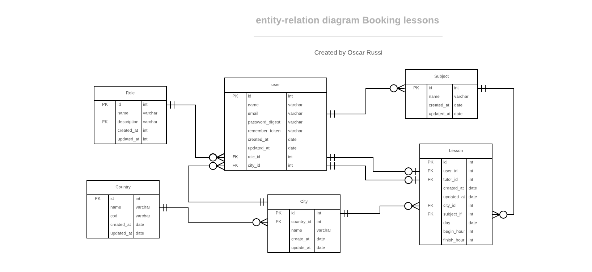

#  Booking lessons

Backend project. API for a booking lessons app

# What it does

- This project is an API about student booking lessons with tutors in the same city
- Student can choose nonspecific date, a range of hours and tutors from his city
- A lesson has a student, a tutor, a city, a date, a begin hour, a finish hour and a subject
- Time of the lesson cannot overlap with other lessons of the student or other lesson of the tutor
- A tutor can log to the system and modified the list of his subjects
- Lesson subject must be a subject from the tutor's subjects
- This project has 87 test cases, 37 for the model and 50 for the controllers
- documentation generated with rdoc and yard (comments in the controllers are for generate the documentation).
- deploy in heroku

# How to run this project

- Install ruby
- Install ruby on rails
- Install bundle
- clone this project
- Run "bundle install" inside folder
- Run "rails db:migrate"
- Run "rails db:seed"
- Run "rails server" inside folder
- Go to http://127.0.0.1:3000/
* OPTIONAL:
- Use Postman to test the API
- Run "rspec" for running the tests
- RUn "rubocop" for running the linter

# live demo

[Live Demo](https://blueberry-custard-86240.herokuapp.com)

## Project Presentation (VIDEO)

[Project Presentation](https://www.loom.com/share/f8e24c7dbe3b42a9b6872b88d4d1fed1)

# Tools

- Ruby
- Ruby on Rails
- Heroku

#### and deployed to GitHub

## Running tests

To run the automated tests, type "rspec" command from the terminal end press enter. You must be inside the project folder.

## Planned Features

https://github.com/andresporras3423/booking-lessons/issues

## Authors

**Oscar Russi**
- Github: [@andresporras3423](https://github.com/andresporras3423/)
- Linkedin: [Oscar Russi](https://www.linkedin.com/in/oscar-andres-russi-porras/)
- Twitter: [@OscarRussi1](https://twitter.com/OscarRussi1)

## � Contributing

This is a project for educational purposes only. We are not accepting contributions.

## Attributions and Credit

Special thanks to Microverse, for this learning opportunity. 

## Show your support

Give a ⭐️ if you like this project!

## Enjoy!

